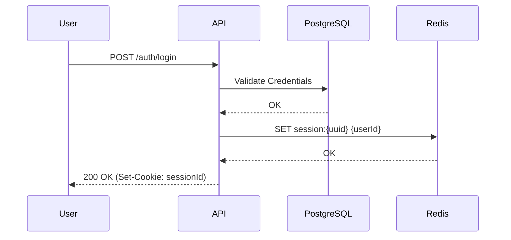
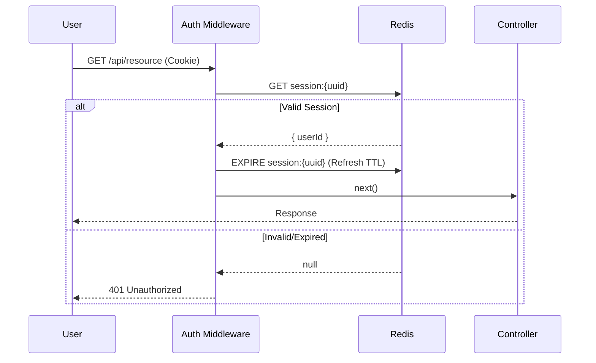

# Authentication System Documentation

## Overview

The Real-Time Task Manager implements a secure, scalable authentication system designed for high performance. It utilizes **Session-based Authentication** backed by **Redis**, ensuring that session validation is fast (sub-millisecond) and decoupled from the primary PostgreSQL database.

Key features include:
-   **Secure Sessions**: Redis-backed with configurable TTL and sliding expiration.
-   **Google OAuth**: Native integration for Google Login.
-   **Security First**: HttpOnly cookies, SameSite=Strict, and minimal PII exposure.

---

## Architecture

### Core Components

1.  **Auth Service**: Handles business logic for registration, login, and Google token verification.
2.  **Session Service**: Manages lifecycle of Redis keys (`create`, `get`, `refresh`, `delete`).
3.  **Auth Middleware**: Intercepts requests, validates session cookies against Redis, and populates `req.user`.

### Data Flow

#### Login Sequence
A user logs in (via Email/Password or Google), and the server issues a session ID stored in a secure cookie.



#### Protected Request Sequence
Every request to a protected route validates the session against Redis.



---

## Configuration

### Environment Variables

Ensure the following variables are set in your `.env` file:

| Variable | Description | Default |
|---|---|---|
| `SESSION_TTL` | Session duration in seconds | `86400` (24h) |
| `REDIS_URL` | Connection string for Redis | `redis://localhost:6379` |
| `GOOGLE_CLIENT_ID` | OAuth Client ID from Google Cloud | - |
| `GOOGLE_CLIENT_SECRET` | OAuth Client Secret from Google Cloud | - |

---

## API Reference

### 1. Register User
Creates a new user account.

-   **Endpoint**: `POST /api/v1/auth/register`
-   **Body**: `{ "email": "...", "password": "..." }`
-   **Response**: `201 Created`

### 2. Login
Authenticates a user and sets the session cookie.

-   **Endpoint**: `POST /api/v1/auth/login`
-   **Body**: `{ "email": "...", "password": "..." }`
-   **Response**: `200 OK`

### 3. Google Login
Authenticates using a Google ID Token.

-   **Endpoint**: `POST /api/v1/auth/google`
-   **Body**: `{ "token": "id_token_from_client" }`
-   **Response**: `200 OK`

### 4. Logout
Invalidates the session in Redis and clears the client cookie.

-   **Endpoint**: `POST /api/v1/auth/logout`
-   **Response**: `200 OK`

### 5. Get Current User
Returns profile information for the currently authenticated user.

-   **Endpoint**: `GET /api/v1/auth/me`
-   **Headers**: `Cookie: sessionId=...`
-   **Response**: `200 OK`

---

## Development & Testing

### Running Tests
The system includes a comprehensive integration test suite covering all auth flows.

```bash
# Run integration tests
npm run test:integration
```

### Manual Verification
You can verify session storage directly in Redis:

```bash
# Connect to Redis container
docker exec -it <redis_container_id> redis-cli

# Check keys
KEYS session:*

# Check TTL (Time To Live)
TTL session:<uuid>
```
