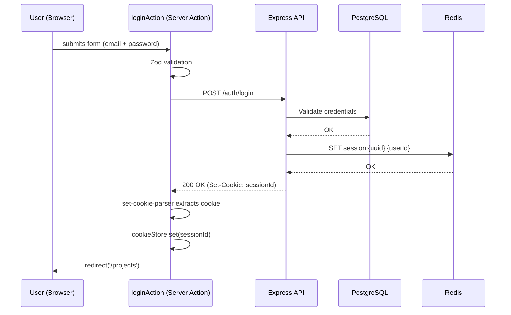
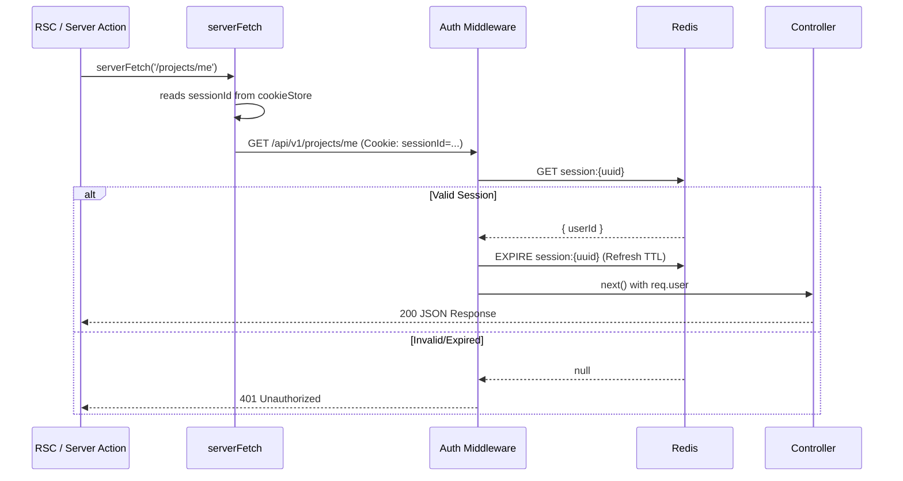

# Authentication System Documentation

> *Last updated: 2026-02-27*

## Overview

The Real-Time Task Manager implements a secure, scalable authentication system backed by **Redis session storage**. The backend issues an `HttpOnly`, `SameSite=Strict` session cookie on login. The Next.js frontend bridges this cookie into Server Actions using a custom `set-cookie-parser` flow.

Key features:
- **Secure Sessions**: Redis-backed with configurable TTL and sliding expiration.
- **Google OAuth**: Native integration for Google Login.
- **Security First**: HttpOnly cookies, SameSite=Strict, and minimal PII exposure.
- **Password Recovery**: Forgot-password and reset-password flows fully implemented.
- **Auto-Login on Register**: After successful registration, the user is automatically logged in.

---

## Architecture

### Core Backend Components

1. **Auth Service** (`backend/src/services/auth.service.ts`): Handles business logic for registration, login, and Google token verification.
2. **Session Service** (`backend/src/services/session.service.ts`): Manages lifecycle of Redis keys (`create`, `get`, `refresh`, `delete`).
3. **Auth Middleware** (`backend/src/middleware/auth.middleware.ts`): Intercepts requests, validates session cookies against Redis, populates `req.user`.

### Core Frontend Components

4. **Server Actions** (`frontend/src/app/actions/auth.actions.ts`): All auth mutations run as Next.js Server Actions. They call the backend directly, extract the `Set-Cookie` header using `set-cookie-parser`, and re-set it into the Next.js `cookieStore`.
5. **`serverFetch`** (`frontend/src/lib/server-api.ts`): Reads the session cookie from `next/headers` and manually forwards it on every outbound server-side fetch.

---

## Data Flow

### Login Sequence (Backend)
A user logs in via Email/Password or Google, and the server issues a session ID stored in a secure cookie.



### Protected Request Sequence (Backend)



---

## Auth Routes

| Route | Method | Action |
|-------|--------|--------|
| `/auth/register` | POST | Create user + auto-login |
| `/auth/login` | POST | Validate creds → set session cookie |
| `/auth/google` | POST | Google ID token → set session cookie |
| `/auth/logout` | POST | Delete Redis session + clear cookie |
| `/auth/me` | GET | Return current user profile |
| `/auth/forgot-password` | POST | Send reset-password email |
| `/auth/reset-password` | POST | Validate token + update password |

---

## Frontend Screens

| Screen | Route | Server Action |
|--------|-------|---------------|
| Login | `/login` | `loginAction` |
| Sign Up | `/signup` | `signupAction` (register + auto-login) |
| Forgot Password | `/forgot-password` | `forgotPasswordAction` |
| Reset Password | `/reset-password?token=...` | `resetPasswordAction` |
| Logout | (Header button) | `logoutAction` (clears cookie + redirect) |

### Zod Schemas (Server Actions)
All auth mutations validate input with Zod on the server before making any API call:
- `loginSchema`: `email` (valid email) + `password` (min 6 chars)
- `signupSchema`: `name` (min 2) + `email` + `password` (min 6) + `confirmPassword` (must match)
- `forgotPasswordSchema`: `email`
- `resetPasswordSchema`: `token` + `password` + `confirmPassword`

---

## Configuration

### Environment Variables

| Variable | Where | Description | Default |
|----------|-------|-------------|---------|
| `SESSION_TTL` | Backend | Session duration in seconds | `86400` (24h) |
| `REDIS_URL` | Backend | Redis connection string | `redis://localhost:6379` |
| `GOOGLE_CLIENT_ID` | Backend | OAuth Client ID | — |
| `GOOGLE_CLIENT_SECRET` | Backend | OAuth Client Secret | — |
| `INTERNAL_API_URL` | Frontend | Backend URL for server-side fetches | `http://localhost:3001/api/v1` |
| `NEXT_PUBLIC_API_URL` | Frontend | Backend URL for client-side fetches | `http://localhost:3001/api/v1` |

---

## Development & Testing

### Manual Verification
Verify session storage directly in Redis:

```bash
# Connect to Redis container
docker exec -it <redis_container_id> redis-cli

# Check keys
KEYS session:*

# Check TTL (Time To Live)
TTL session:<uuid>
```

### Running Tests
```bash
# Backend integration tests
cd backend && npm run test:integration
```
