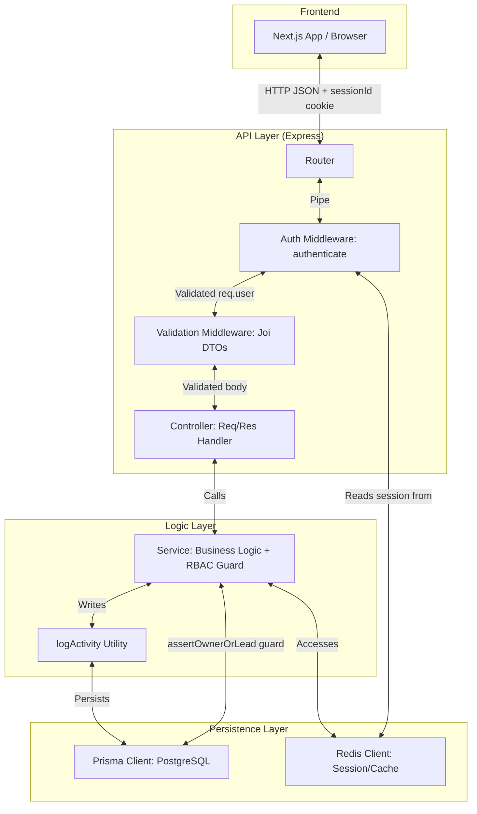
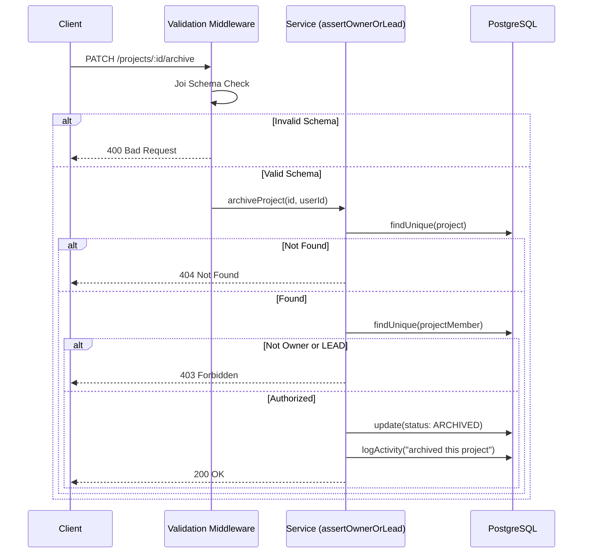
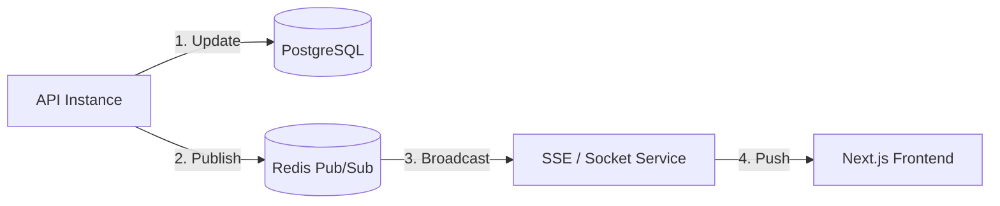

# System Data Flow

> *Last updated: 2026-02-27*

This document details how information travels through the Real-Time Task Manager backend.

## 1. Request Lifecycle
We follow a streamlined **Controller-Service** architecture. Each layer has a specific, non-overlapping responsibility.

### Layer Responsibilities
| Layer | Responsibility |
| :--- | :--- |
| **Router** | Maps HTTP paths and methods to specific controllers. |
| **Auth Middleware** | Validates `sessionId` cookie against Redis; populates `req.user`. Rejects with `401` if invalid. |
| **Validation Middleware** | Uses Joi DTOs to reject malformed request bodies with `400` before reaching the controller. |
| **Controller** | Extracts `params`, `query`, and `body`; calls the appropriate service method; formats the HTTP response. |
| **Service** | The "Core" — implements business rules, performs Prisma queries, enforces RBAC via `assertOwnerOrLead`, writes `ProjectActivity` records. |
| **logActivity** | Shared utility that inserts a `ProjectActivity` row for every significant mutation, optionally within a Prisma transaction. |

---

## 2. Validation Flow
Validation occurs in two stages to ensure data integrity:
1. **Schema Validation (Joi DTOs)**: Middleware rejects malformed requests before they reach the controller.
2. **RBAC Business Validation**: `assertOwnerOrLead` in the Service layer checks that the authenticated user is the project owner or holds the `LEAD` role before any write operation is executed.

---

## 3. Project Data Flow: Key Endpoints

| Endpoint | Controller | Service Method | Notes |
|----------|-----------|----------------|-------|
| `GET /projects/me` | `getMyProjects` | `getMyProjects(userId)` | Filters by `owner_id`, excludes `ARCHIVED` |
| `GET /projects/:id` | `getProjectById` | `getProjectById(id)` | Includes tasks, members, last 5 activities, computed progress |
| `POST /projects` | `createProject` | `createProject(data)` | `owner_id` from session; runs in Prisma `$transaction`; creates `ProjectMember` (LEAD) + activity log |
| `PATCH /projects/:id/archive` | `archiveProject` | `archiveProject(id, userId)` | RBAC guarded; logs activity |
| `POST /projects/:id/members` | `addProjectMember` | `addProjectMember(...)` | RBAC guarded; looks up user by email; logs activity |

---

## 4. Real-Time Sync (Pub/Sub)
Updates are pushed to clients using a Redis-backed event system.

1. **Trigger**: A service performs a write operation (e.g., `updateTask`).
2. **Publish**: The service publishes an event to a specific Redis channel.
3. **Notify**: Real-time handlers (SSE/WebSockets) subscribed to that channel push the update to connected clients.

