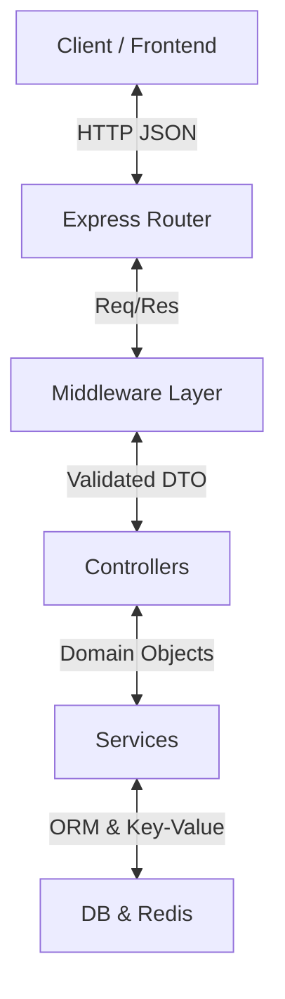
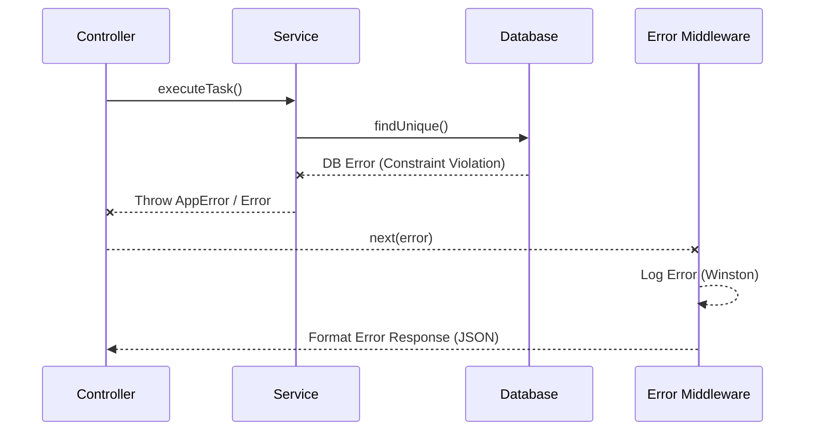
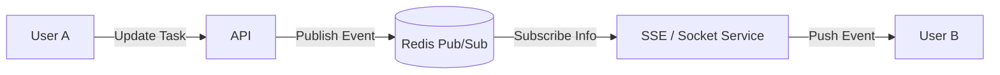

# System Data Flow

This document outlines how data moves through the backend application, from the incoming request to the database and back.

## 1. Request Lifecycle (Layered Architecture)

The application follows a strict **Controller-Service** pattern to ensure separation of concerns.

### Layers Description
1.  **Router & Middleware**: 
    -   Handles Routing (`/api/v1/...`).
    -   **Validation**: Joi schemas validate headers/body before reaching controllers.
    -   **Auth**: Verifies Session IDs via Redis.
    
2.  **Controller Layer**:
    -   Parses the request (query params, body).
    -   Calls the appropriate `Service` method.
    -   Formatted the HTTP response (Status codes, JSON structure).
    -   *Crucial*: Controllers **never** access the database directly.

3.  **Service Layer**:
    -   Contains all **Business Logic**.
    -   interacts with Prisma (PostgreSQL) and Redis.
    -   Handles data transformation and error throwing.

4.  **Data Layer**:
    -   **Prisma Client**: Type-safe database queries.
    -   **Redis Client**: Session management and caching.

---

## 2. Error Handling Flow

Errors are propagated up the stack and caught by a centralized Error Handling Middleware.

-   **Operational Errors**: (e.g., 400 Bad Request, 404 Not Found) are thrown explicitly.
-   **System Errors**: (e.g., DB connection fail) are caught and converted to 500 Internal Server Error.

---

## 3. Real-Time Data Flow (Planned)

For real-time updates (e.g., "Task Updated" notifications), we utilize Redis Pub/Sub.

