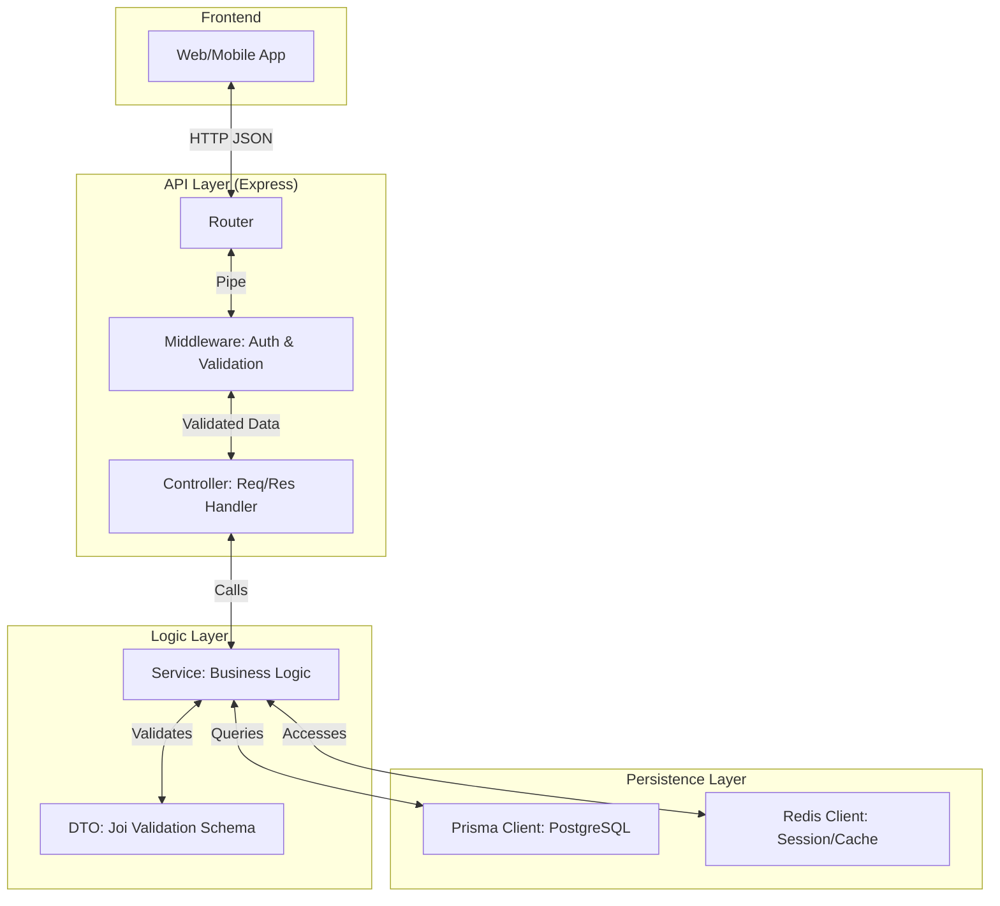
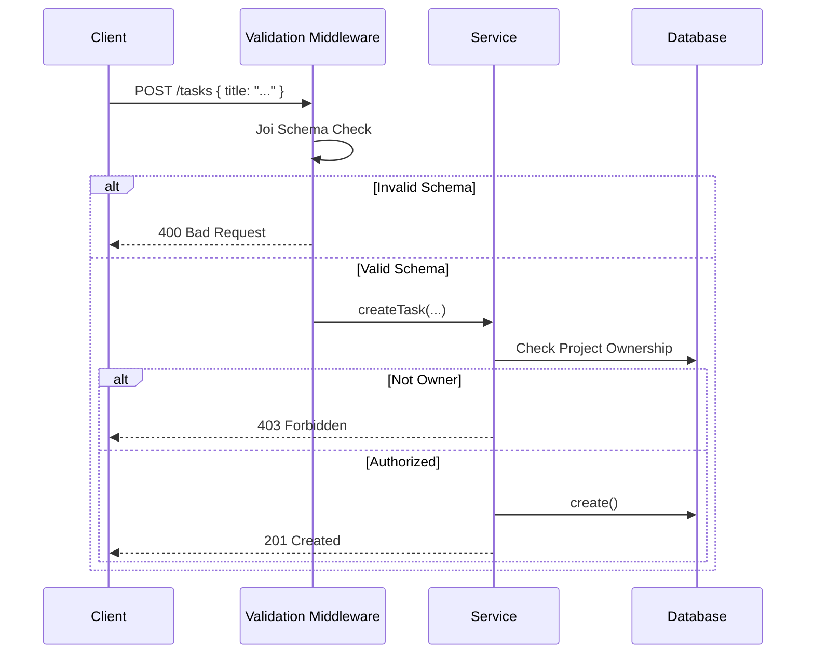
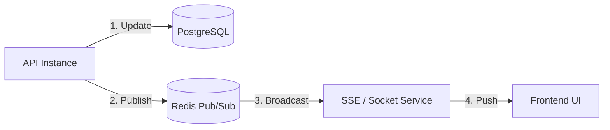

# System Data Flow

> *Last updatedAt: 2026-02-23*

This document details how information travels through the Real-Time Task Manager backend.

## 1. Request Lifecycle
We follow a streamlined **Controller-Service** architecture. Each layer has a specific, non-overlapping responsibility.

### Layer Responsibilities
| Layer | Responsibility |
| :--- | :--- |
| **Router** | Maps HTTP paths and methods to specific controllers. |
| **Middleware** | Handles cross-cutting concerns (Authentication, Global Error Handling, Request Logging). |
| **Controller** | Extracts parameters (params, query, body), calls services, and formats the HTTP response. |
| **Service** | The "Core" - implements business rules, performs database operations via Prisma, and interacts with Redis. |
| **DTO** | Defines the "shape" of incoming data and provides validation logic via Joi. |

---

## 2. Validation Flow
Validation occurs in two stages to ensure data integrity:
1. **Schema Validation**: Middleware Uses Joi DTOs to reject malformed requests before they hit the controller.
2. **Business Validation**: Services perform deeper checks (e.g., "Does this user own the project they are adding a task to?").

---

## 3. Real-Time Sync (Pub/Sub)
Updates are pushed to clients using a Redis-backed event system.

1. **Trigger**: A service performs a write operation (e.g., `updateTask`).
2. **Publish**: The service publishes an event to a specific Redis channel.
3. **Notify**: Real-time handlers (SSE/WebSockets) subscribed to that channel push the update to connected clients.

